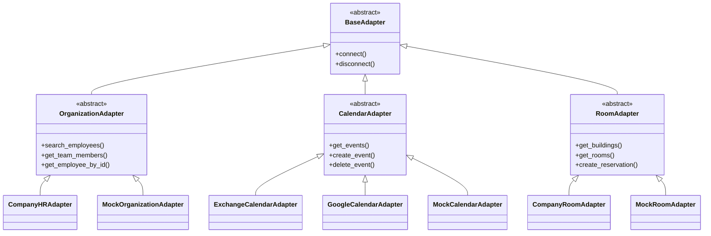

# API 연동 가이드

Meeting Scheduler AI를 사내 시스템과 연동하기 위한 가이드입니다.

## 연동 대상 API

| API | 용도 | 필수 여부 | 우선순위 |
|-----|------|----------|---------|
| [직원 조회 API](employee-api.md) | 조직도, 직원 정보 검색 | :material-check-circle: 필수 | 1 |
| [일정 조회 API](calendar-api.md) | 개인 일정 조회/등록 | :material-check-circle: 필수 | 2 |
| [회의실 API](room-api.md) | 회의실 정보 및 예약 | :material-check-circle: 필수 | 3 |

## 연동 방식

### Adapter 패턴

모든 외부 API 연동은 **Adapter 패턴**을 사용합니다. 이를 통해:

- 외부 API 스펙 변경에 유연하게 대응
- 테스트를 위한 Mock Adapter 제공
- 여러 시스템 지원 (예: Microsoft 365, Google Workspace)



### 인증 방식

외부 API 호출 시 지원하는 인증 방식:

| 방식 | 설명 | 사용 사례 |
|-----|------|----------|
| **API Key** | 정적 키 기반 인증 | 간단한 내부 API |
| **OAuth 2.0 Client Credentials** | 서버 간 인증 | 대부분의 엔터프라이즈 API |
| **OAuth 2.0 + User Token** | 사용자 대리 인증 | 개인 캘린더 접근 |
| **mTLS** | 상호 TLS 인증 | 고보안 환경 |

## 환경 설정

```bash title=".env"
# API 공통 설정
API_TIMEOUT=30
API_RETRY_COUNT=3

# 직원 조회 API
EMPLOYEE_API_URL=https://hr.company.com/api/v1
EMPLOYEE_API_AUTH_TYPE=oauth2_client  # api_key, oauth2_client, oauth2_user
EMPLOYEE_API_CLIENT_ID=your-client-id
EMPLOYEE_API_CLIENT_SECRET=your-client-secret

# 일정 조회 API
CALENDAR_API_URL=https://calendar.company.com/api/v1
CALENDAR_API_AUTH_TYPE=oauth2_user
CALENDAR_API_CLIENT_ID=your-client-id
CALENDAR_API_CLIENT_SECRET=your-client-secret

# 회의실 API
ROOM_API_URL=https://room.company.com/api/v1
ROOM_API_AUTH_TYPE=api_key
ROOM_API_KEY=your-api-key
```

## 연동 단계

### 1단계: Mock 데이터로 테스트

기본 제공되는 Mock Adapter로 시스템 동작을 확인합니다.

```python
# backend/config.py
USE_MOCK_ADAPTERS = True  # Mock 모드 활성화
```

### 2단계: Adapter 구현

회사 API 스펙에 맞는 Adapter를 구현합니다.

```python
# backend/services/adapters/company_hr_adapter.py
from .organization_adapter import OrganizationAdapter

class CompanyHRAdapter(OrganizationAdapter):
    async def search_employees(self, query: str) -> list[Employee]:
        # 구현
        pass
```

### 3단계: 설정 및 테스트

환경 변수를 설정하고 테스트합니다.

```bash
# 테스트 실행
pytest tests/test_adapters.py -v
```

### 4단계: 프로덕션 배포

Mock 모드를 비활성화하고 배포합니다.

```python
# backend/config.py
USE_MOCK_ADAPTERS = False
```

## 다음 단계

각 API별 상세 연동 가이드를 확인하세요:

- [직원 조회 API 연동](employee-api.md)
- [일정 조회 API 연동](calendar-api.md)
- [회의실 API 연동](room-api.md)
