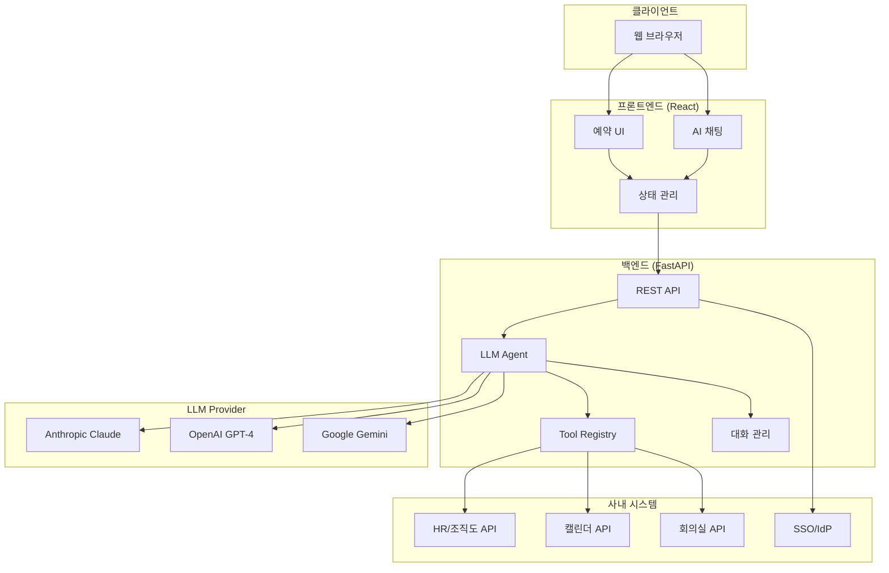
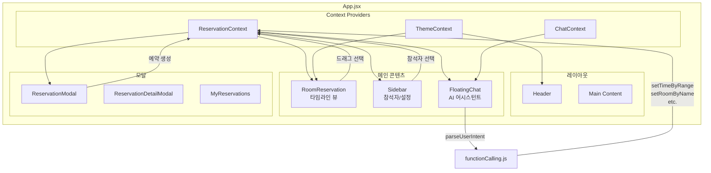
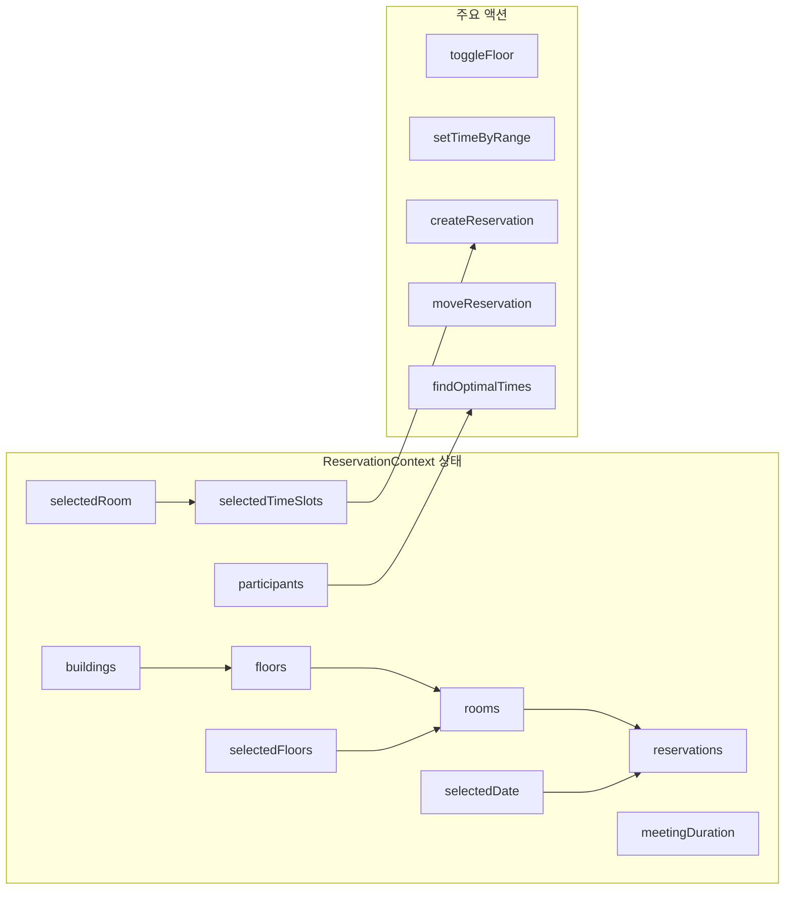
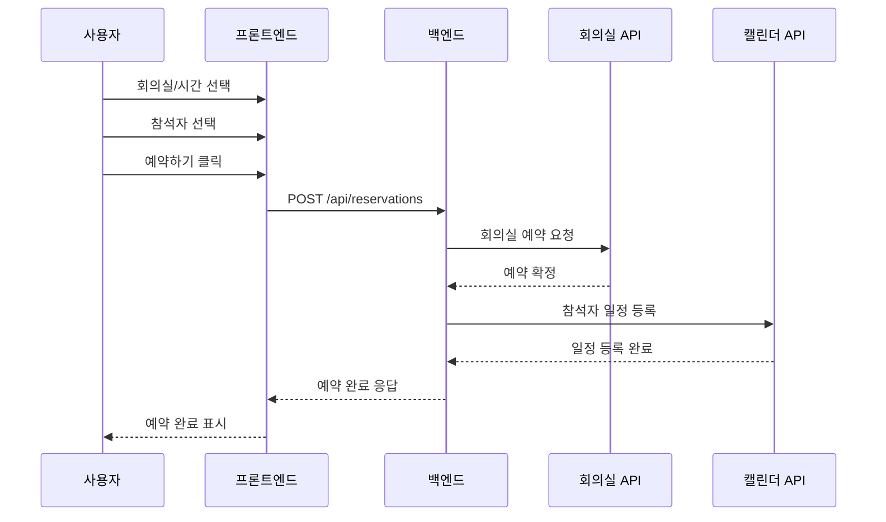
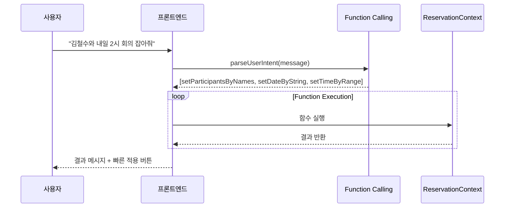
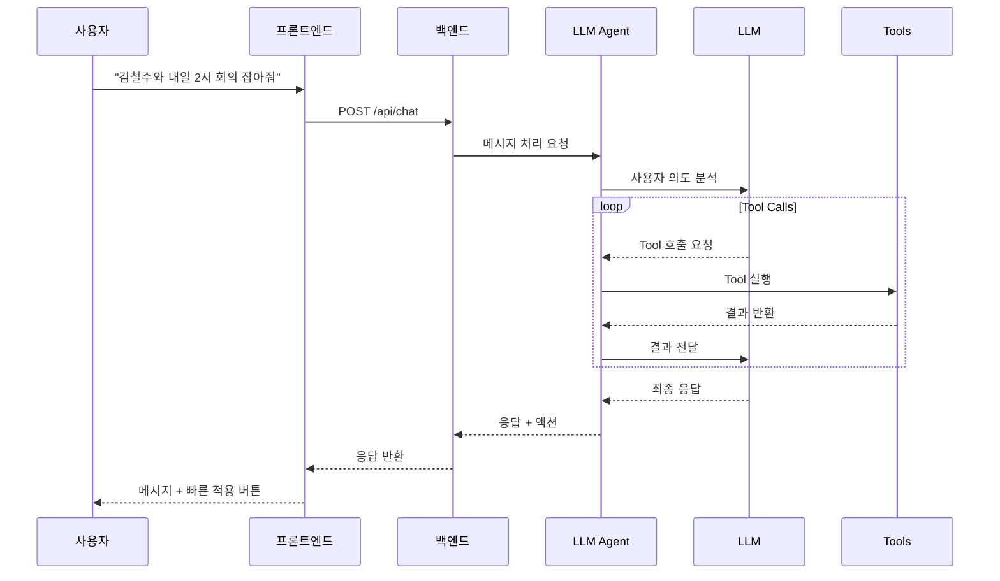

# 아키텍처

## 시스템 구성도



## 컴포넌트 설명

### 프론트엔드

| 컴포넌트 | 설명 |
|---------|------|
| **예약 UI** | 회의실 타임라인, 참석자 선택, 예약 폼 |
| **AI 채팅** | 플로팅 채팅 창, 자연어 명령 처리 |
| **상태 관리** | React Context를 사용한 전역 상태 관리 |

### 프론트엔드 컴포넌트 구조



### 상태 관리 구조



### 백엔드

| 컴포넌트 | 설명 |
|---------|------|
| **REST API** | FastAPI 기반 RESTful API 서버 |
| **LLM Agent** | 자연어 처리 및 도구 호출 오케스트레이션 |
| **Tool Registry** | 외부 API 연동 도구 관리 |
| **대화 관리** | 대화 컨텍스트 및 세션 관리 |

## 데이터 흐름

### 일반 예약 흐름



### AI 채팅 흐름 (프론트엔드 Function Calling)

프론트엔드에서 직접 사용자 의도를 파싱하고 함수를 실행하는 방식입니다.



### AI 채팅 흐름 (백엔드 LLM Agent)

백엔드 LLM이 의도를 분석하고 도구를 호출하는 방식입니다.



## 기술 스택

### 프론트엔드

- **React 18**: UI 프레임워크
- **Vite**: 빌드 도구
- **Tailwind CSS**: 스타일링
- **React Context**: 상태 관리

### 백엔드

- **FastAPI**: 웹 프레임워크
- **Pydantic**: 데이터 검증
- **httpx**: 비동기 HTTP 클라이언트
- **Python 3.11+**: 런타임

### LLM 연동

- **Anthropic Claude**: 기본 LLM
- **OpenAI GPT-4**: 대안 LLM
- **Google Gemini**: 대안 LLM

## 확장 포인트

### Adapter 패턴

외부 시스템 연동은 Adapter 패턴을 사용하여 구현됩니다:

```python
# backend/services/adapters/organization_adapter.py
class OrganizationAdapter(ABC):
    @abstractmethod
    async def search_employees(self, query: str) -> list[Employee]:
        pass

    @abstractmethod
    async def get_team_members(self, team_id: str) -> list[Employee]:
        pass

# 구현체
class CompanyHRAdapter(OrganizationAdapter):
    def __init__(self, api_url: str, client_id: str, client_secret: str):
        self.api_url = api_url
        # ...

    async def search_employees(self, query: str) -> list[Employee]:
        # 회사 HR API 호출
        response = await self.client.get(f"{self.api_url}/employees", params={"q": query})
        return [Employee(**emp) for emp in response.json()]
```

### 새로운 API 연동 추가

1. `backend/services/adapters/`에 새 Adapter 구현
2. `backend/agent/tools/`에 새 Tool 추가
3. `backend/config.py`에 설정 추가

자세한 내용은 각 API 연동 가이드를 참고하세요.
