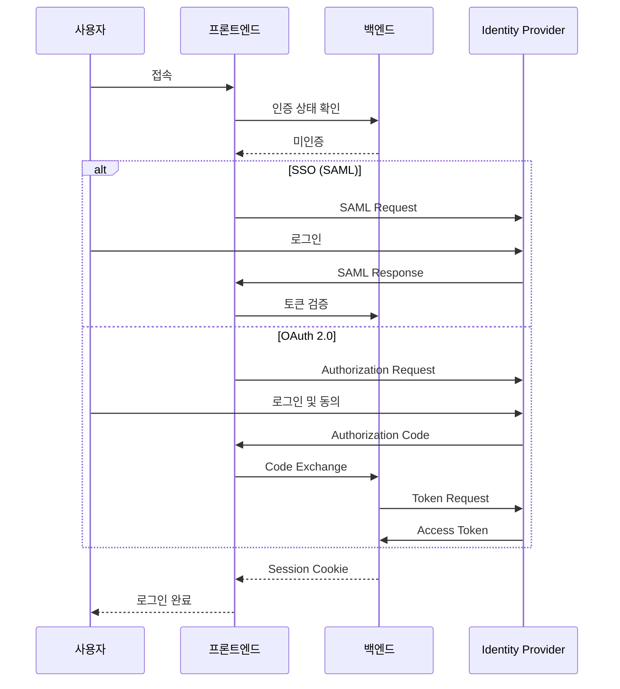

# 인증 연동 가이드

Meeting Scheduler AI의 인증 시스템을 사내 환경에 맞게 연동하는 방법을 설명합니다.

## 지원 인증 방식

| 방식 | 설명 | 권장 사용 사례 |
|-----|------|---------------|
| [SSO (SAML 2.0)](sso-integration.md) | 기업 IdP 연동 | 대기업, 그룹웨어 연동 |
| [OAuth 2.0 / OIDC](oauth-setup.md) | 표준 OAuth 프로토콜 | Azure AD, Okta, Google |
| API Key | 정적 키 인증 | 개발/테스트 환경 |

## 인증 아키텍처



## 환경별 권장 설정

### 개발 환경

```bash title=".env.development"
# 인증 비활성화 (개발 편의)
AUTH_ENABLED=false
AUTH_MOCK_USER=true
MOCK_USER_ID=emp_001
MOCK_USER_NAME=개발자
```

### 스테이징 환경

```bash title=".env.staging"
AUTH_ENABLED=true
AUTH_PROVIDER=oauth2

# 테스트용 OAuth (예: Auth0)
OAUTH_ISSUER_URL=https://test.auth0.com
OAUTH_CLIENT_ID=test-client-id
OAUTH_CLIENT_SECRET=test-secret
```

### 프로덕션 환경

```bash title=".env.production"
AUTH_ENABLED=true
AUTH_PROVIDER=saml

# 기업 SSO
SSO_ISSUER_URL=https://idp.company.com
SSO_ENTITY_ID=meeting-scheduler
SSO_CERTIFICATE_PATH=/etc/ssl/idp-cert.pem
```

## 세션 관리

### 세션 저장소

| 방식 | 설명 | 사용 사례 |
|-----|------|----------|
| Memory | 서버 메모리 저장 | 단일 서버, 개발 |
| Redis | Redis 저장 | 다중 서버, 프로덕션 |
| Database | DB 저장 | 감사 로그 필요 시 |

```bash title=".env"
SESSION_STORE=redis
REDIS_URL=redis://localhost:6379/0
SESSION_TTL=28800  # 8시간
```

### 세션 보안

```bash title=".env"
# 세션 쿠키 설정
SESSION_COOKIE_NAME=meeting_session
SESSION_COOKIE_SECURE=true      # HTTPS 전용
SESSION_COOKIE_HTTPONLY=true    # JavaScript 접근 차단
SESSION_COOKIE_SAMESITE=Lax     # CSRF 방지
```

## 권한 관리 (RBAC)

### 역할 정의

| 역할 | 설명 | 권한 |
|-----|------|------|
| `user` | 일반 사용자 | 예약 생성/조회 |
| `admin` | 관리자 | 모든 예약 관리, 설정 |
| `room_manager` | 회의실 관리자 | 회의실 설정 |

### 권한 매핑 설정

```python title="backend/config.py"
ROLE_MAPPINGS = {
    # IdP 그룹 → 애플리케이션 역할
    "CN=MeetingScheduler-Admins,OU=Groups,DC=company,DC=com": "admin",
    "CN=RoomManagers,OU=Groups,DC=company,DC=com": "room_manager",
    "*": "user"  # 기본 역할
}
```

## 다음 단계

- [SSO 연동 상세 가이드](sso-integration.md)
- [OAuth 2.0 설정 가이드](oauth-setup.md)
