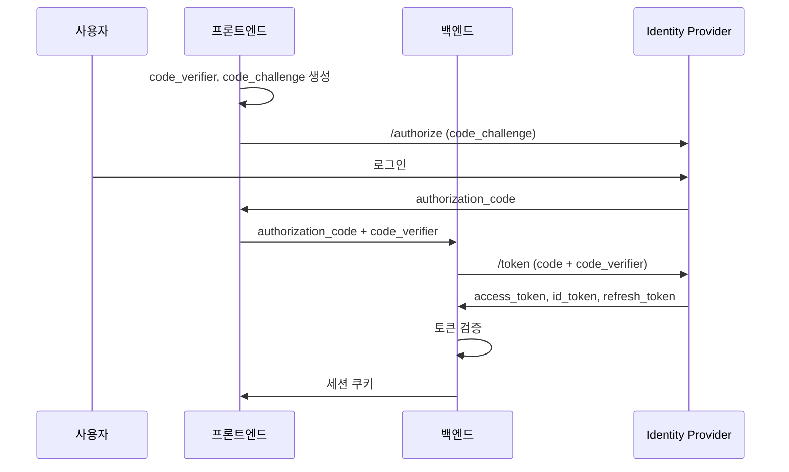

# OAuth 2.0 설정 가이드

OAuth 2.0 / OpenID Connect(OIDC)를 사용하여 인증을 연동하는 방법을 설명합니다.

## 개요

OAuth 2.0 / OIDC 연동의 장점:

- 표준화된 프로토콜
- 다양한 IdP 지원
- 토큰 기반 인증
- API 접근 제어 용이

## 지원 플로우

| 플로우 | 사용 사례 | 보안 수준 |
|-------|----------|----------|
| Authorization Code + PKCE | 웹 애플리케이션 (권장) | :material-star::material-star::material-star: |
| Authorization Code | 서버 사이드 앱 | :material-star::material-star: |
| Client Credentials | 서버 간 통신 | :material-star::material-star: |

## Authorization Code Flow (PKCE)

### 인증 흐름



### 구현

=== "프론트엔드"

    ```typescript
    // 1. PKCE Challenge 생성
    function generatePKCE() {
      const verifier = generateRandomString(128);
      const challenge = base64URLEncode(sha256(verifier));
      sessionStorage.setItem('pkce_verifier', verifier);
      return challenge;
    }

    // 2. 로그인 시작
    function startLogin() {
      const challenge = generatePKCE();
      const state = generateRandomString(32);
      sessionStorage.setItem('oauth_state', state);

      const params = new URLSearchParams({
        response_type: 'code',
        client_id: OAUTH_CLIENT_ID,
        redirect_uri: REDIRECT_URI,
        scope: 'openid profile email',
        state: state,
        code_challenge: challenge,
        code_challenge_method: 'S256'
      });

      window.location.href = `${OAUTH_AUTHORIZE_URL}?${params}`;
    }

    // 3. 콜백 처리
    async function handleCallback() {
      const params = new URLSearchParams(window.location.search);
      const code = params.get('code');
      const state = params.get('state');

      // State 검증
      if (state !== sessionStorage.getItem('oauth_state')) {
        throw new Error('Invalid state');
      }

      // 백엔드로 코드 교환 요청
      const verifier = sessionStorage.getItem('pkce_verifier');
      const response = await fetch('/api/auth/callback', {
        method: 'POST',
        headers: { 'Content-Type': 'application/json' },
        body: JSON.stringify({ code, code_verifier: verifier })
      });

      if (response.ok) {
        window.location.href = '/';
      }
    }
    ```

=== "백엔드"

    ```python
    from fastapi import APIRouter, HTTPException
    import httpx

    router = APIRouter()

    @router.post("/auth/callback")
    async def oauth_callback(code: str, code_verifier: str):
        """OAuth 콜백 처리"""

        # 토큰 교환
        async with httpx.AsyncClient() as client:
            response = await client.post(
                settings.oauth_token_url,
                data={
                    "grant_type": "authorization_code",
                    "client_id": settings.oauth_client_id,
                    "client_secret": settings.oauth_client_secret,
                    "code": code,
                    "code_verifier": code_verifier,
                    "redirect_uri": settings.oauth_redirect_uri,
                }
            )

        if response.status_code != 200:
            raise HTTPException(400, "Token exchange failed")

        tokens = response.json()

        # ID 토큰 검증
        user_info = verify_id_token(tokens["id_token"])

        # 세션 생성
        session = create_session(user_info)

        return {"session_id": session.id}
    ```

## IdP별 설정

### Azure AD

=== "앱 등록"

    1. Azure Portal → **Azure Active Directory** → **앱 등록**
    2. **새 등록**:
        - 이름: "Meeting Scheduler"
        - 지원되는 계정 유형: "이 조직 디렉터리의 계정만"
        - 리디렉션 URI: `https://meeting.company.com/auth/callback`
    3. **인증서 및 비밀** → **새 클라이언트 비밀**
    4. **API 권한** → **권한 추가**:
        - Microsoft Graph: `openid`, `profile`, `email`, `User.Read`

=== "환경 변수"

    ```bash
    AUTH_PROVIDER=oidc

    # Azure AD 설정
    OAUTH_ISSUER_URL=https://login.microsoftonline.com/{tenant-id}/v2.0
    OAUTH_AUTHORIZE_URL=https://login.microsoftonline.com/{tenant-id}/oauth2/v2.0/authorize
    OAUTH_TOKEN_URL=https://login.microsoftonline.com/{tenant-id}/oauth2/v2.0/token
    OAUTH_USERINFO_URL=https://graph.microsoft.com/oidc/userinfo
    OAUTH_JWKS_URL=https://login.microsoftonline.com/{tenant-id}/discovery/v2.0/keys

    OAUTH_CLIENT_ID=your-client-id
    OAUTH_CLIENT_SECRET=your-client-secret
    OAUTH_REDIRECT_URI=https://meeting.company.com/auth/callback
    OAUTH_SCOPES=openid profile email
    ```

### Okta

=== "앱 생성"

    1. Okta Admin → **Applications** → **Create App Integration**
    2. Sign-in method: **OIDC - OpenID Connect**
    3. Application type: **Web Application**
    4. Grant type: **Authorization Code**
    5. Sign-in redirect URIs: `https://meeting.company.com/auth/callback`
    6. Sign-out redirect URIs: `https://meeting.company.com`

=== "환경 변수"

    ```bash
    AUTH_PROVIDER=oidc

    # Okta 설정
    OAUTH_ISSUER_URL=https://{your-okta-domain}/oauth2/default
    OAUTH_AUTHORIZE_URL=https://{your-okta-domain}/oauth2/default/v1/authorize
    OAUTH_TOKEN_URL=https://{your-okta-domain}/oauth2/default/v1/token
    OAUTH_USERINFO_URL=https://{your-okta-domain}/oauth2/default/v1/userinfo
    OAUTH_JWKS_URL=https://{your-okta-domain}/oauth2/default/v1/keys

    OAUTH_CLIENT_ID=your-client-id
    OAUTH_CLIENT_SECRET=your-client-secret
    ```

### Google Workspace

=== "프로젝트 설정"

    1. Google Cloud Console → **API 및 서비스** → **사용자 인증 정보**
    2. **사용자 인증 정보 만들기** → **OAuth 클라이언트 ID**
    3. 애플리케이션 유형: **웹 애플리케이션**
    4. 승인된 리디렉션 URI: `https://meeting.company.com/auth/callback`
    5. OAuth 동의 화면 구성 (내부 사용자)

=== "환경 변수"

    ```bash
    AUTH_PROVIDER=oidc

    # Google 설정
    OAUTH_ISSUER_URL=https://accounts.google.com
    OAUTH_AUTHORIZE_URL=https://accounts.google.com/o/oauth2/v2/auth
    OAUTH_TOKEN_URL=https://oauth2.googleapis.com/token
    OAUTH_USERINFO_URL=https://openidconnect.googleapis.com/v1/userinfo
    OAUTH_JWKS_URL=https://www.googleapis.com/oauth2/v3/certs

    OAUTH_CLIENT_ID=your-client-id.apps.googleusercontent.com
    OAUTH_CLIENT_SECRET=your-client-secret

    # Google Workspace 도메인 제한
    OAUTH_HD=company.com
    ```

## Client Credentials Flow

서버 간 API 호출에 사용합니다.

```python
from datetime import datetime, timedelta
import httpx

class OAuth2ClientCredentials:
    """Client Credentials Flow 구현"""

    def __init__(self, token_url: str, client_id: str, client_secret: str):
        self.token_url = token_url
        self.client_id = client_id
        self.client_secret = client_secret
        self._token = None
        self._expires_at = None

    async def get_token(self) -> str:
        """유효한 액세스 토큰 반환"""
        if self._token and self._expires_at > datetime.now():
            return self._token

        async with httpx.AsyncClient() as client:
            response = await client.post(
                self.token_url,
                data={
                    "grant_type": "client_credentials",
                    "client_id": self.client_id,
                    "client_secret": self.client_secret,
                    "scope": "api.read api.write"
                }
            )
            response.raise_for_status()

            data = response.json()
            self._token = data["access_token"]
            self._expires_at = datetime.now() + timedelta(seconds=data["expires_in"] - 60)

            return self._token
```

## 토큰 검증

### ID 토큰 검증

```python
from jose import jwt, JWTError
import httpx

async def verify_id_token(token: str) -> dict:
    """ID 토큰 검증"""

    # 헤더에서 kid 추출
    unverified_header = jwt.get_unverified_header(token)
    kid = unverified_header["kid"]

    # JWKS에서 공개키 조회
    async with httpx.AsyncClient() as client:
        response = await client.get(settings.oauth_jwks_url)
        jwks = response.json()

    # kid에 해당하는 키 찾기
    key = None
    for k in jwks["keys"]:
        if k["kid"] == kid:
            key = k
            break

    if not key:
        raise JWTError("Key not found")

    # 토큰 검증
    try:
        payload = jwt.decode(
            token,
            key,
            algorithms=["RS256"],
            audience=settings.oauth_client_id,
            issuer=settings.oauth_issuer_url
        )
        return payload
    except JWTError as e:
        raise HTTPException(401, f"Invalid token: {e}")
```

### 액세스 토큰 검증

```python
async def verify_access_token(token: str) -> dict:
    """액세스 토큰으로 사용자 정보 조회"""

    async with httpx.AsyncClient() as client:
        response = await client.get(
            settings.oauth_userinfo_url,
            headers={"Authorization": f"Bearer {token}"}
        )

        if response.status_code != 200:
            raise HTTPException(401, "Invalid access token")

        return response.json()
```

## 토큰 갱신

```python
async def refresh_tokens(refresh_token: str) -> dict:
    """리프레시 토큰으로 새 토큰 발급"""

    async with httpx.AsyncClient() as client:
        response = await client.post(
            settings.oauth_token_url,
            data={
                "grant_type": "refresh_token",
                "client_id": settings.oauth_client_id,
                "client_secret": settings.oauth_client_secret,
                "refresh_token": refresh_token,
            }
        )

        if response.status_code != 200:
            raise HTTPException(401, "Token refresh failed")

        return response.json()
```

## 보안 고려사항

!!! danger "보안 체크리스트"

    - [x] PKCE 필수 사용 (공개 클라이언트)
    - [x] State 파라미터 검증
    - [x] HTTPS 필수
    - [x] 토큰 안전 저장 (httpOnly 쿠키)
    - [x] 리프레시 토큰 rotation
    - [x] 적절한 scope 제한

### 토큰 저장

```python
# 권장: httpOnly 쿠키
response.set_cookie(
    key="access_token",
    value=token,
    httponly=True,
    secure=True,
    samesite="Lax",
    max_age=3600
)

# 비권장: localStorage (XSS 취약)
# localStorage.setItem('access_token', token)
```

## 문제 해결

### "invalid_client" 오류

```
원인: Client ID/Secret 불일치

확인:
1. Client ID 정확성
2. Client Secret 만료 여부
3. Redirect URI 일치 여부
```

### "invalid_grant" 오류

```
원인: Authorization Code 만료 또는 재사용

확인:
1. Code는 1회만 사용 가능
2. Code 유효 시간 (보통 10분)
3. PKCE verifier 일치 여부
```

### CORS 오류

```javascript
// 프론트엔드에서 직접 토큰 교환 시 CORS 오류 발생
// 해결: 백엔드를 통해 토큰 교환
```

## 다음 단계

- [데이터 모델 레퍼런스](../reference/data-models.md)
- [에러 코드 레퍼런스](../reference/error-codes.md)
