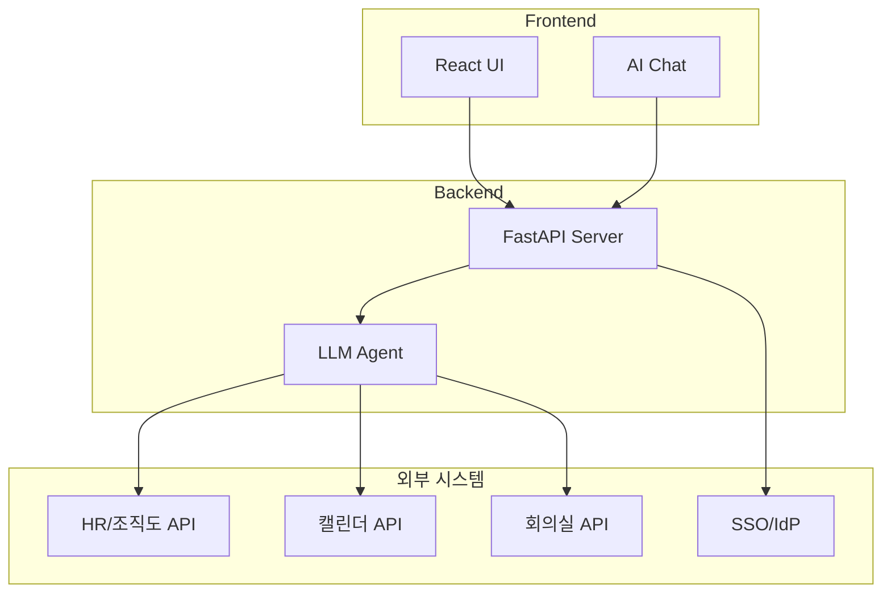

# Meeting Scheduler AI

**AI 기반 회의 일정 조율 시스템 연동 가이드**

---

## Demo

<div style="text-align: center; margin: 2rem 0;">
  <iframe
    width="100%"
    height="400"
    src="https://www.youtube.com/embed/9EwUjulNWqc"
    frameborder="0"
    allow="accelerometer; autoplay; clipboard-write; encrypted-media; gyroscope; picture-in-picture"
    allowfullscreen
    style="max-width: 720px; border-radius: 8px; box-shadow: 0 4px 6px rgba(0,0,0,0.1);">
  </iframe>
</div>

## 개요

Meeting Scheduler AI는 LLM(Large Language Model)을 활용하여 자연어로 회의 일정을 조율하고 회의실을 예약할 수 있는 시스템입니다. 기존 사내 시스템(그룹웨어, HR 시스템, 캘린더 등)과 연동하여 사용할 수 있습니다.

## 주요 기능

- :material-chat-processing: **자연어 회의 예약** - "세미나실 A 오전 10시 예약해줘", "대회의실 B 2시부터 3시까지"
- :material-lightning-bolt: **빠른 적용** - AI가 분석한 회의실, 시간, 참석자를 원클릭으로 적용
- :material-account-search: **스마트 참석자 검색** - 이름, 부서, 직급, 그룹으로 직원 검색
- :material-calendar-clock: **최적 시간 추천** - 참석자들의 일정을 분석하여 최적의 회의 시간 추천
- :material-filter-variant: **회의실 검색/필터** - 이름, 수용인원, 장비(프로젝터, 화이트보드 등)로 필터링
- :material-layers-triple: **멀티 플로어 뷰** - 여러 층의 회의실을 동시에 확인
- :material-door: **회의실 실시간 현황** - 건물/층별 회의실 예약 현황 확인
- :material-gesture-swipe-horizontal: **드래그 예약** - 타임라인에서 드래그로 시간 선택, 예약 이동/리사이즈
- :material-theme-light-dark: **다크모드 지원** - 시스템 설정 또는 수동 전환
- :material-repeat: **반복 회의 지원** - 매일, 매주, 격주, 매월 반복 예약

<figure markdown="span">
  { width="100%" }
  <figcaption>Meeting Scheduler AI 메인 화면 - 회의실 타임라인과 AI 채팅</figcaption>
</figure>

## 연동 대상 시스템

본 시스템을 사내에 도입하기 위해 다음 시스템과의 연동이 필요합니다:

| 연동 시스템 | 용도 | 필수 여부 |
|------------|------|----------|
| [직원 조회 API](api/employee-api.md) | 조직도, 직원 정보 조회 | :material-check-circle: 필수 |
| [일정 조회 API](api/calendar-api.md) | 개인 일정 조회/등록 | :material-check-circle: 필수 |
| [회의실 API](api/room-api.md) | 회의실 정보 및 예약 | :material-check-circle: 필수 |
| [SSO 연동](guides/sso-integration.md) | 통합 인증 | :material-alert-circle: 권장 |

## 빠른 시작

```bash
# 저장소 클론
git clone https://github.com/geniuskey/magnet.git
cd magnet

# 백엔드 실행
cd backend
pip install -r requirements.txt
uvicorn main:app --reload --port 8080

# 프론트엔드 실행 (새 터미널)
cd frontend
npm install
npm run dev
```

## 아키텍처 개요



## 문서 구성

<div class="grid cards" markdown>

-   :material-rocket-launch:{ .lg .middle } **시작하기**

    ---

    설치 및 초기 설정 방법

    [:octicons-arrow-right-24: 시작하기](getting-started/index.md)

-   :material-api:{ .lg .middle } **API 연동**

    ---

    직원, 일정, 회의실 API 연동 가이드

    [:octicons-arrow-right-24: API 가이드](api/index.md)

-   :material-shield-account:{ .lg .middle } **인증 연동**

    ---

    SSO 및 OAuth 2.0 연동 가이드

    [:octicons-arrow-right-24: 인증 가이드](guides/index.md)

-   :material-book-open-variant:{ .lg .middle } **레퍼런스**

    ---

    데이터 모델 및 에러 코드

    [:octicons-arrow-right-24: 레퍼런스](reference/index.md)

</div>

## 지원

- :material-github: [GitHub Issues](https://github.com/geniuskey/magnet/issues)
- :material-email: 기술 지원: support@company.com
